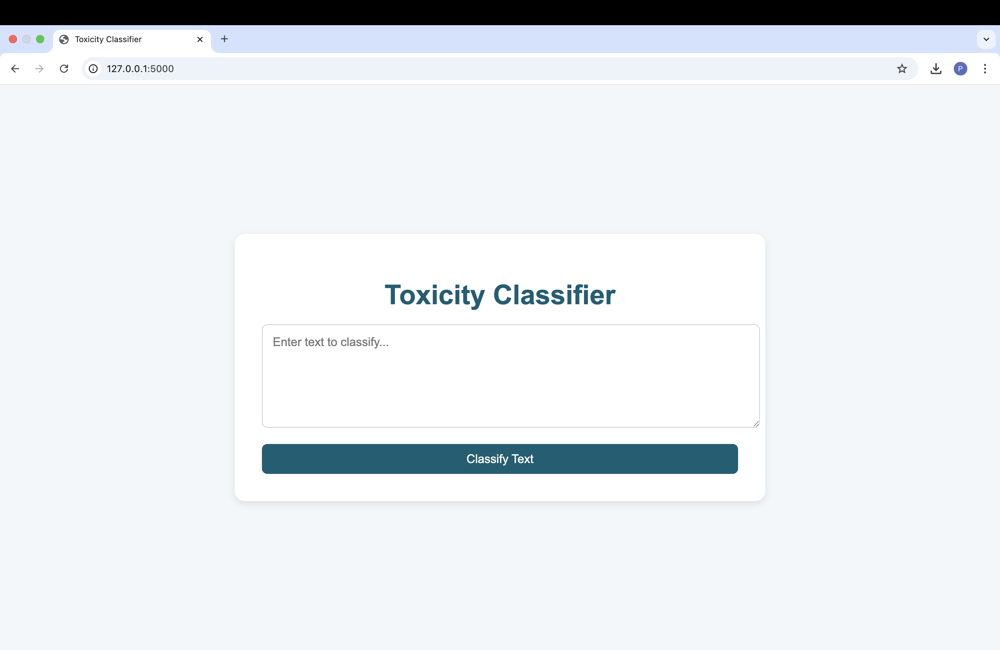
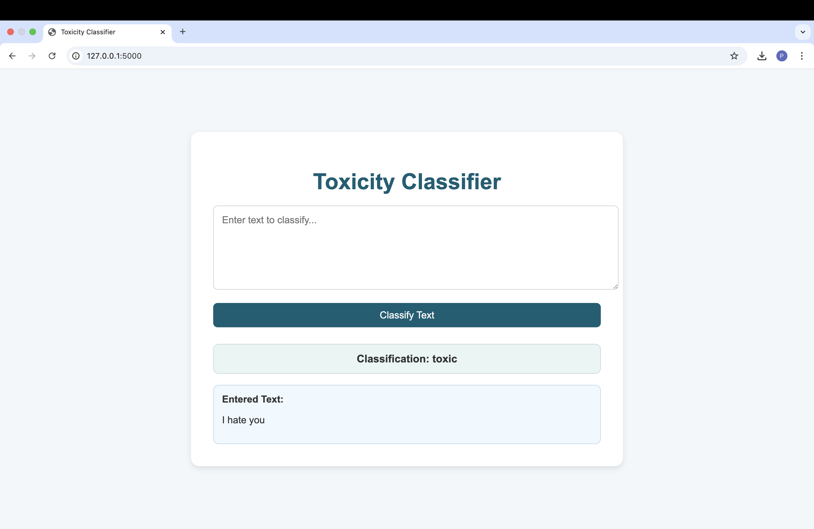

# Distillation and LoRA for Toxic Comment Classification

This project explores the comparison between **Odd Layer**, **Even Layer**, and **LoRA (Low-Rank Adaptation)** fine-tuning methods for distilling a **BERT-based model** on a **toxic comment classification** task. The goal is to evaluate the performance of these methods and develop a web application for classifying toxic comments.

**1. Odd Layer Distillation:** Transferring knowledge from the odd layers of a 12-layer BERT teacher model to a 6-layer student model.

**2. Even Layer Distillation:** Transferring knowledge from the even layers of a 12-layer BERT teacher model to a 6-layer student model.

**3. LoRA (Low-Rank Adaptation):** Fine-tuning the full 12-layer BERT model using Low-Rank Adaptation, a parameter-efficient fine-tuning method.

## Dataset

The **OxAISH-AL-LLM/wiki_toxic** dataset is a collection of comments from Wikipedia discussions, annotated for toxic content. It is designed for training and evaluating models to detect toxic or harmful language, such as hate speech, insults, or offensive remarks. The dataset is widely used in natural language processing (NLP) tasks, particularly for toxicity classification and moderation.

**Source:** [OxAISH-AL-LLM/wiki_toxic](https://huggingface.co/datasets/OxAISH-AL-LLM/wiki_toxic)

### Preprocessing
- Tokenize the text using a BERT tokenizer.
- Remove unnecessary columns and rename the label column for compatibility with PyTorch.
- Split the dataset into training, validation, and test sets.

## Odd Layer and Even Layer Training
- **Objective:** Train student models using knowledge distillation from either the odd or even layers of the teacher model.

- **Implementation:**
    - **Odd Layer Training:**
        - The student model was initialized with half the number of layers of the teacher model (6 layers).
        - Weights from the odd layers (1, 3, 5, 7, 9, 11) of the 12-layer teacher model were transferred to the student model.
        - The student model was fine-tuned using a combination of classification loss, distillation loss (KL divergence), and cosine similarity loss.

    - **Even Layer Training:**
        - Similarly, weights from the even layers (2, 4, 6, 8, 10, 12) of the teacher model were transferred to the student model.
        - The same training procedure was followed as for the odd layer model.

## LoRA (Low-Rank Adaptation)
- **Objective:** Implement LoRA to fine-tune the full 12-layer BERT model.
- **Implementation:**
    - LoRA was applied to the student model using the `peft` library.
    - A LoRA configuration was defined with a rank of 8, a scaling factor of 32, and a dropout rate of 0.1.
    - The model was fine-tuned using the same dataset and training procedure as the distillation models.

## Evaluation and Analysis

### 1. Evaluation
- All models were evaluated on the test set using **accuracy** as the metric.
- The results are summarized in the table below:

|Model Type|Avg. Training Loss|Avg. Test Set Accuracy|
|-----------|-----------|-----------|
|Odd Layer|0.1841|0.9548|
|Even Layer|0.4169|0.1160|
|LoRA|0.1279|0.9472|

**Odd Layer:** Achieved the highest test set accuracy (95.48%) and a low training loss (0.1841).

**Even Layer:** Performed poorly, with the lowest test set accuracy (11.60%) and the highest training loss (0.4169).

**LoRA:** Achieved nearly the highest test set accuracy (94.72%) and the lowest training loss (0.1279).

Therefore, the **Odd Layer model** will be used for the web application, as it is **the best model** for this case according to the result.

### 2. Analysis

**Odd Layer and Even Layer Models**
- **Performance:**
    - These are distilled versions of the teacher model, retaining only half of the layers (odd or even).
    - They are smaller and faster than the full model but may have lower performance due to reduced capacity.
    - The performance difference between Odd and Even Layer models depends on which layers are more critical for the task. In this case, the Odd Layer model significantly outperformed the Even Layer model (95.48% vs. 11.60% accuracy).

- **Strengths:**
    - **Efficiency:** Fewer parameters and layers make them faster and more memory-efficient.
    - **Distillation:** If the teacher model is strong, the distilled student models can achieve competitive performance.

- **Weaknesses:**
    - **Performance Trade-off:** They may underperform on complex tasks due to reduced capacity.
    - **Dependence on Teacher Model:** Their performance heavily relies on the quality of the teacher model.

**LoRA Model**
- **Performance:**
    - LoRA fine-tunes the full model by adding low-rank adapters, allowing it to adapt to the task without losing the original model's capacity.
    - It typically achieves better performance than Odd/Even Layer models, as seen in this project (94.72% accuracy), while being parameter-efficient.

- **Strengths:**
    - **High Performance:** Retains the full model's capacity and adapts better to the task.
    - **Parameter Efficiency:** Adds only a small number of trainable parameters, making it efficient.

- **Weaknesses:**
    - **Computational Cost:** Slightly slower than Odd/Even Layer models because it works with the full model.
    - **Hyperparameter Tuning:** Requires careful tuning of LoRA-specific hyperparameters (e.g., rank, scaling factor, dropout rate).

### 3. Challenges

**Teacher Model Issues with LoRA**
- If the teacher model is modified by LoRA (even unintentionally), it can cause errors during distillation or evaluation. For example:
    - The teacher model's state dictionary may include LoRA-specific parameters, which are incompatible with the student model's architecture.

**Distillation vs. LoRA**
- **Distillation:**
    - Requires a strong teacher model.
    - The student model (Odd/Even Layer) has reduced capacity, which can limit performance.

- **LoRA:**
    - Requires careful tuning of hyperparameters (e.g., rank, scaling factor, dropout rate).
    - Adds computational overhead compared to distillation.

### 4. Proposed Improvements
**Ensure Teacher Model is Unmodified:**
- Before applying LoRA, ensure the teacher model is in its original state (not modified by LoRA). Use the original BERT model for distillation to avoid conflicts.

**Separate Workflows for Distillation and LoRA:**
- Keep the workflows for Odd/Even Layer models and LoRA models separate to avoid conflicts.
- Train and evaluate Odd/Even Layer models first, then train and evaluate the LoRA model.

**Hyperparameter Tuning for LoRA:**
- Experiment with different values for LoRA hyperparameters (e.g., rank, scaling factor, dropout rate) to find the best configuration for the task.

## Web Application
A **Flask-based** web application is developed to classify whether a given text input is toxic or non-toxic. The web app uses the trained **BERT-based student model** (fine-tuned using distillation or LoRA) to provide predictions on user input.

### Features
- **Input:** Users can enter a text prompt in an input box.
- **Output:** The model classifies the text as **toxic** or **non-toxic** and displays the result.

### Web Application Sample Screenshot

**Homepage**


**Sample Response**


## Installation

**1. Clone the Repository:** Clone the repository to your local machine.
```bash
git clone https://github.com/Prapatsorn-A/toxicity-classifier.git
cd toxicity-classifier
```

**2. Install Dependencies:** Install the dependencies listed in `requirements.txt`.
```bash
pip install -r requirements.txt
```

**3. Run the Flask App:**
```bash
cd app
python app.py
```

**4. Access the Web Application:**
- Open your browser and go to `http://127.0.0.1:5000`.

## Acknowledgements
- Hugging Face for the `transformers` library and datasets.
- `peft` library for LoRA implementation.
- OxAISH-AL-LLM for the `wiki_toxic` dataset.
- **Professor Chaklam Silpasuwanchai** and **Teaching Assistant Todsavad Tangtortan** for guidance and support

**Link to the notebooks:** 
- [distilBERT.ipynb](https://github.com/chaklam-silpasuwanchai/Python-fo-Natural-Language-Processing/blob/main/Code/04%20-%20Huggingface/Appendix%20-%20Efficient%20Network%20Training/01-distilation/distilBERT.ipynb)
- [PEFT_from_hf.ipynb](https://github.com/chaklam-silpasuwanchai/Python-fo-Natural-Language-Processing/blob/main/Code/04%20-%20Huggingface/Appendix%20-%20Efficient%20Network%20Training/03-peft/PEFT_from_hf.ipynb)